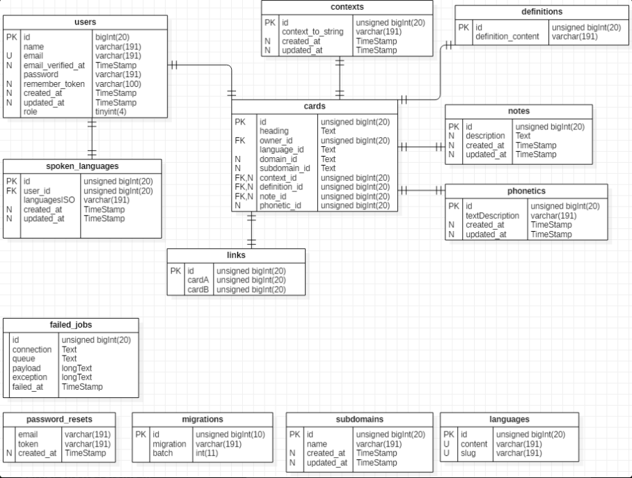

# PRJG5 - GMI

## Nécessite

* Git 2.17.1
* PHP 7.3.10
* Composer 1.9.0
* Laravel 6.0.4
* PHPUnit 8
* Librairie benSempo/laravels-enum 1.26

## Xampp (A faire avant Installation si vous utilisez Xampp)

1. Démarrer Xampp (MySql et Apache)

2. Créer la base de données

Pour cela, vous pouvez ouvrir Xampp et ouvrir phpMyAdmin via le bouton "Admin"

Nommer la base de données "laravel" en utf32_general_ci

## Installation

1. Clone le repo

```bash
git clone https://github.com/PRJG5/gmi.git
```

2. Installer les dépendances

```bash
composer install
```

3. Copier les variables d'environnement

```bash
cp  .env.example .env
```

Modifier le fichier `.env` pour convenir à ses besoins

4. Générer une clef d'encryption

```bash
php artisan key:generate
```

## Nettoyer  le cache

```bash
php artisan cache:clear
php artisan route:cache
php artisan config:clear
php artisan view:clear
composer dump-autoload
```

## Migrations 

Pour mettre à jour votre branche voici les étapes à suivre : 

1. Aller sur le master et le mettre à jour 
```git checkout master
   git pull
```

2. Aller sur votre branch et merge le master avec votre branche
```git checkout [nomBranche]
   git merge master
```

3. Si vous avez certains conflits,vous pouvez les résoudres via VSC,les classes qui posent problèmes sont marquées en bleu
   Dés que vous avez fini de régler les conflits :
```git add .
   git commit -m "[message]"
```
Enfin,il faut mettre a jour le composer et les migrations de votre base de donnée locale 
```composer install
   php artisan migrate:refresh
```

Pour mettre à jour le master il faut suivre exactement les mêmes étapes que ci-dessus. N'oubliez surtout pas de push le projet
après avoir effectué le merge sur la branche master

## Base de donnée 
Pour faciliter l'aperçu de la base de donnée, je vous demandes de compléter le fichier .mdj a chaque changement de la base de donnée.Pour trouver plus de détail,veuillez consulter le fichier mdj

Actuellement la base de donnée ressemble à ceci : 



## Liens utiles

* Trello `https://trello.com/b/jy7V3IfE/gmi`
* FAQ `https://poesi.esi-bru.be/mod/wiki/view.php?id=1613`

## Sonar-cube

1. Clone le projet

2. Télécharger sonarqube-7.8 et sonnar-scanner-cli

3. Installer composer

4. Lancer Xampp (MySql et Apache)

5. Faire l'étape "Xampp"

6. Lancer la commande "composer install"

7. Lancer le serveur Sonar 
	-> StartSonar.bat

8. Aller sur http://localhost:9000
9. Se connecter en 
	-> User : admin 
	-> MDP : admin

10. Créer un nouveau projet nommé GMI
11. Copier la clé genérée grâce au bouton "Analyse"
12. La clé ressemble a ceci : "46c6277f7dab9eac3a981fec7ee4681619d70b25"

13. Remplacer le sonar.projectKey par GMI

14. Rajouter la variable d'environnement vers sonar-scanner.bat
	-> Exemple : "C:\Sonar\sonar-scanner\bin"

15. Ouvrir sonar-project.properties et remplacer la clé de sonar.login par la nouvelle clé

16. Aller dans C:\xampp\php et ouvrir php.ini (Le fichier de configuration nommé php)
17. Coller à la fin : 
	
	[XDebug]
	; Only Zend OR (!) XDebug
	zend_extension=C:\xampp\php\ext\php_xdebug.dll
	; XAMPP and XAMPP Lite 1.7.0 and later come with a bundled xdebug at /php/ext/php_xdebug.dll, without a version number.
	xdebug.remote_enable=1
	xdebug.remote_host=127.0.0.1
	xdebug.remote_port=9000
	; Port number must match debugger port number in NetBeans IDE Tools > Options > PHP
	xdebug.remote_handler=dbgp
	xdebug.profiler_enable=1
	xdebug.profiler_output_dir="C:\sonarqube\temp"
	xdebug.var_display_max_depth = 10
	xdebug.var_display_max_data = 2048

18. Se placer dans le dossier du projet

19. Lancer le client Sonar
	-> sonar-scanner

20. Sur le localhost:9000, aller dans GMI -> Administration -> PHP et remplacer Default par PSR-2

21. Relancer un sonar-scanner

# Laravel

## License

The Laravel framework is open-source software licensed under the [MIT license](https://opensource.org/licenses/MIT).
